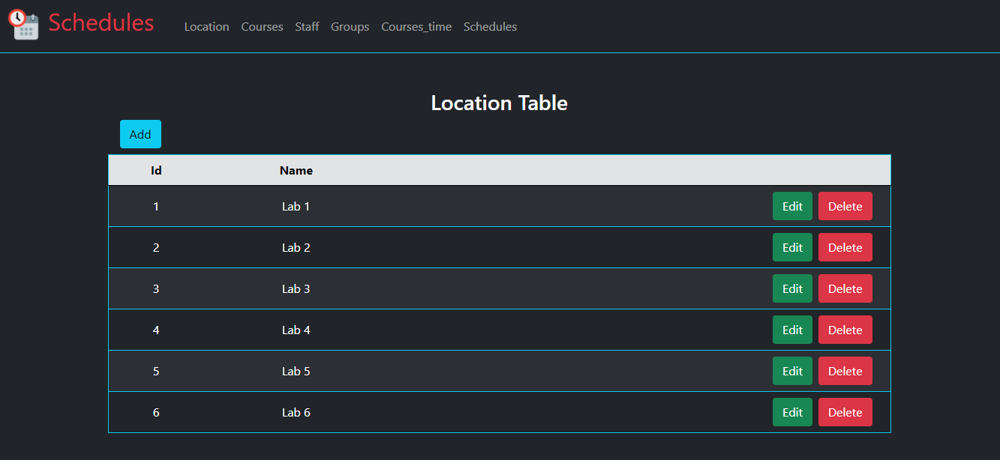
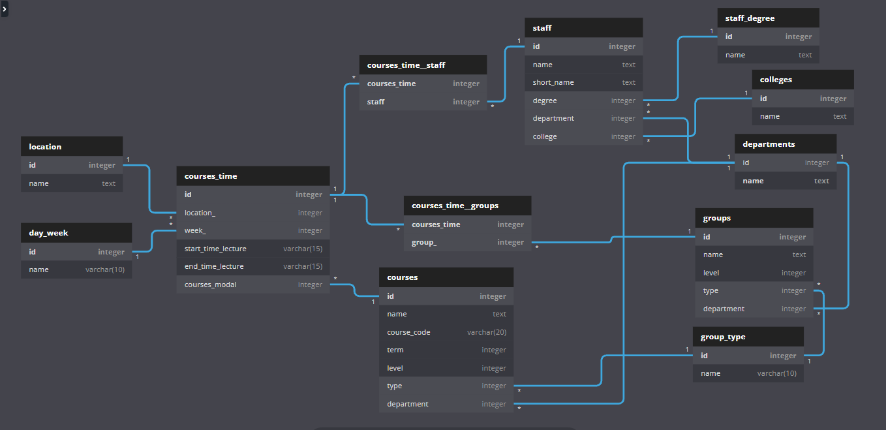

<!-- ## Python OR JS Convert html to png  -->
# Schedules
Site for preparing the lecture schedule for study groups

**In Front End, a percentage of the reliance was made on the Distribution code [finance - Distribution](https://cs50.harvard.edu/x/2021/psets/9/finance/)**




## Run
```sh
	export FLASK_APP=application.py 
	flask run
```

## Using 
1. Enter Data to Location
1. Enter Data to Courses
1. Enter Data to Staffs
1. Enter Data to Groups
1. Enter Data to Time
1. View the result by page Schedules


## Requirements
- pyhton3
- flask
- sqlite3


## Schema



## Tree Project 
```sh
.
├── Demo.png
├── README.md
├── application.py
├── helpers.py
├── query.sql
├── requirements.txt
├── schema.png
├── schema.sql
├── static
│   ├── app.js
│   ├── favicon.ico
│   └── style.css
├── table_edu.db
└── templates
    ├── courses.html
    ├── courses_time.html
    ├── functionals
    │   ├── data_view.html
    │   ├── data_view_readonly.html
    │   └── modal.html
    ├── groups.html
    ├── layout.html
    ├── location.html
    ├── schedules.html
    └── staff.html
```


## Tools
- Pyhton
- SQLite3
- Java Script 
- Bootstrap
- dbdiagram.io
